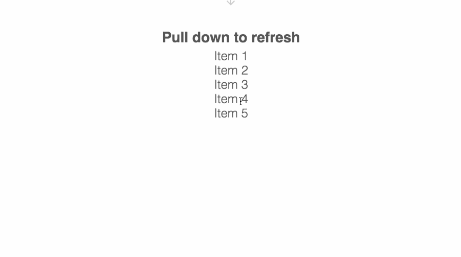

# react-pull-to-refresh

`npm install react-pull-to-refresh -S`

A pull to refresh component for the web.

Based on Andy Peatling's [Pull to Refresh for the Web](https://github.com/apeatling/web-pull-to-refresh)



## Usage

Your refresh handler function takes in `resolve` and `reject` to tell the PullToRefresh component when it's finished.

```typescript
async handleRefresh() {
  await asyncCode();
}

```

Where you want to render the component:

```typescript
<ReactPullToRefresh onRefresh={handleRefresh} className="your-own-class-if-you-want" style={{ textAlign: 'center' }}>
  <h3>Pull down to refresh</h3>
  <div>{items}</div>
  <div>etc.</div>
</ReactPullToRefresh>
```

## CSS

Use the CSS from [the example](playground/app.css) as a starting point.

## All props

```typescript
export interface ReactPullToRefreshProps extends HTMLAttributes<HTMLDivElement> {
  onRefresh: () => Promise<void>;
  icon?: ReactNode;
  loading?: ReactNode;
  disabled?: boolean;
  distanceToRefresh?: number;
  resistance?: number;
  hammerOptions?: {
    cssProps?: CssProps | undefined;
    domEvents?: boolean | undefined;
    enable?: boolean | ((manager:  HammerManager) => boolean) | undefined;
    preset?: RecognizerTuple[] | undefined;
    touchAction?: string | undefined;
    recognizers?: RecognizerTuple[] | undefined;
    inputClass?: HammerInput | undefined;
    inputTarget?: EventTarget | undefined;
  }
```

- **onRefresh**: `() => Promise<void>`
- **icon**: `ReactNode`
  - _default:_
  ```html
  <span className="genericon genericon-next"></span>
  ```
- **loading**: `ReactNode`
  - _default:_
  ```html
  <div className="loading">
    <span className="loading-ptr-1"></span>
    <span className="loading-ptr-2"></span>
    <span className="loading-ptr-3"></span>
  </div>
  ```
- **disabled**: `boolean`
- **className**: `string`
- **style**: `object`
- **distanceToRefresh**: `number`
  - _default_: `70`
- **resistance**: `number`
  - _default_: `2.5`
- **hammerOptions**: `HammerOptions`
  ```typescript
  interface HammerOptions {
    cssProps?: CssProps | undefined;
    domEvents?: boolean | undefined;
    enable?: boolean | ((manager: HammerManager) => boolean) | undefined;
    preset?: RecognizerTuple[] | undefined;
    touchAction?: string | undefined;
    recognizers?: RecognizerTuple[] | undefined;
    inputClass?: HammerInput | undefined;
    inputTarget?: EventTarget | undefined;
  }
  ```

## Thanks

[Andy Peatling](http://apeatling.com/)
